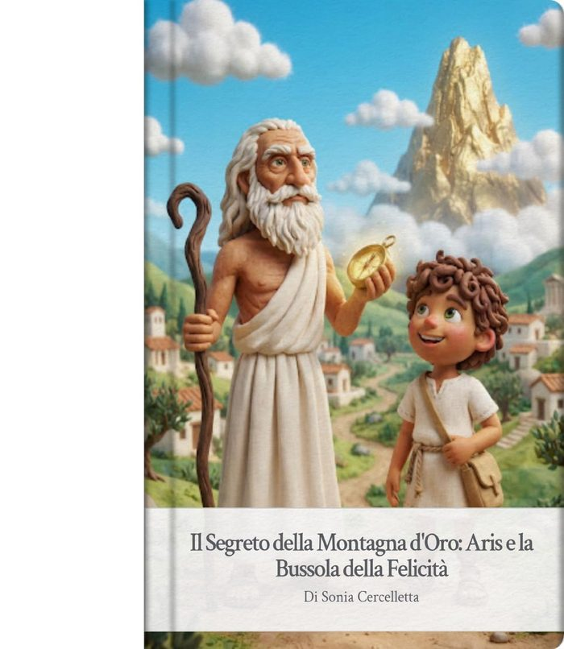
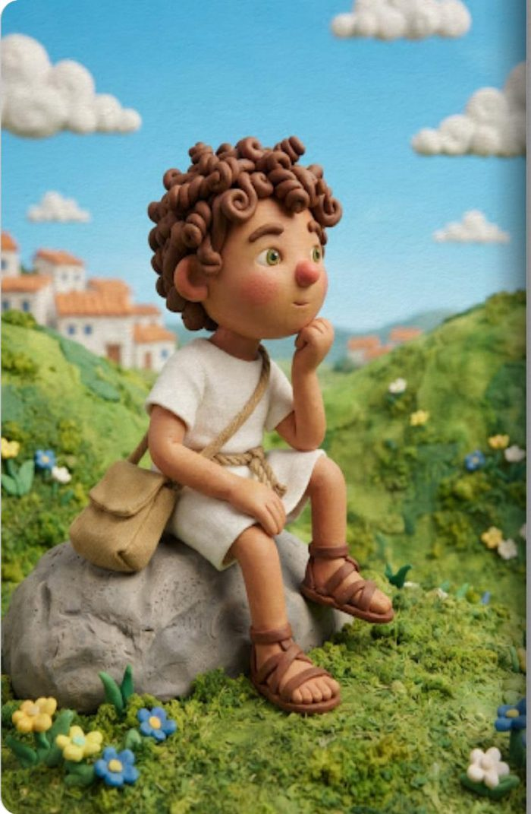
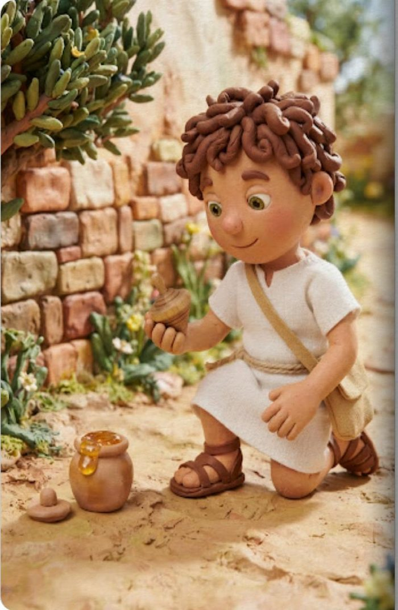
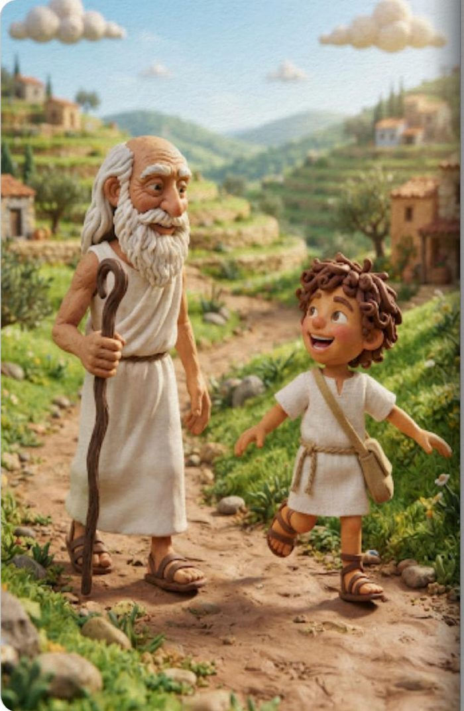
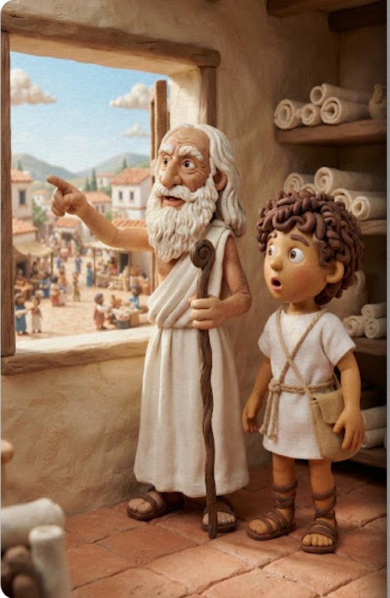
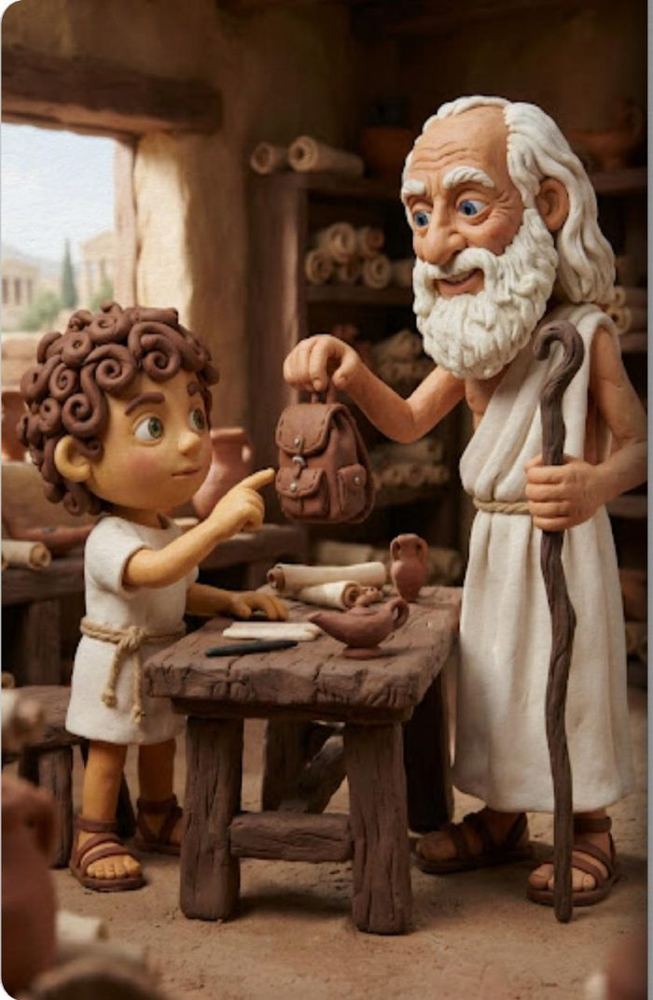
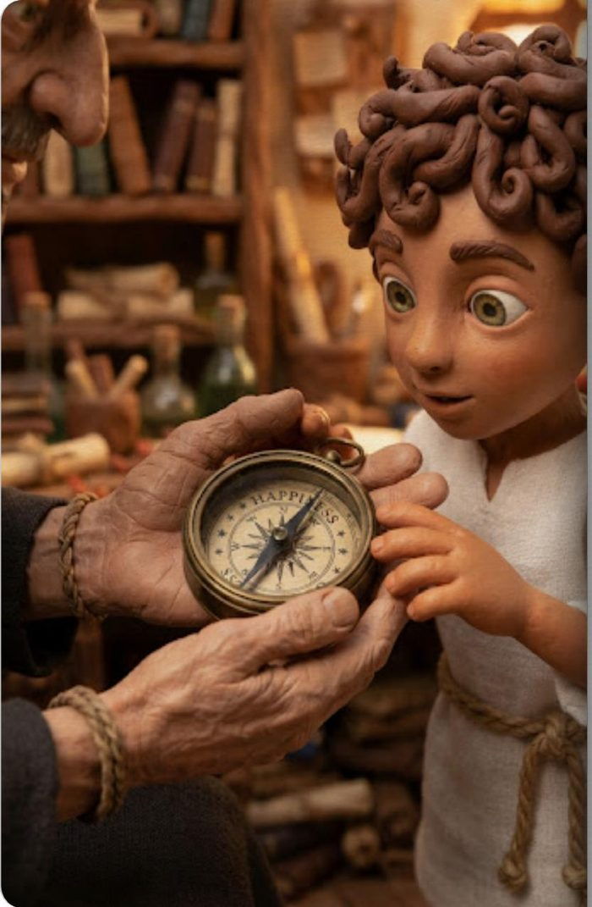
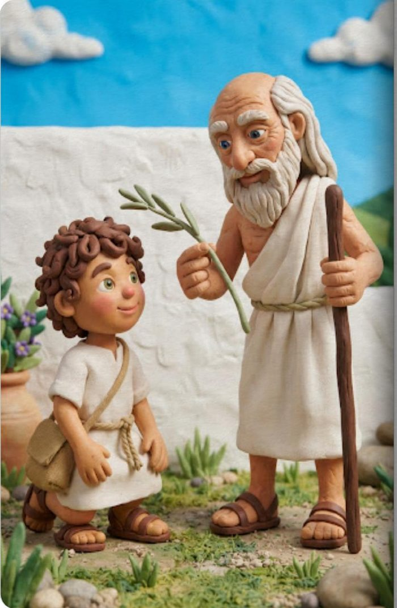
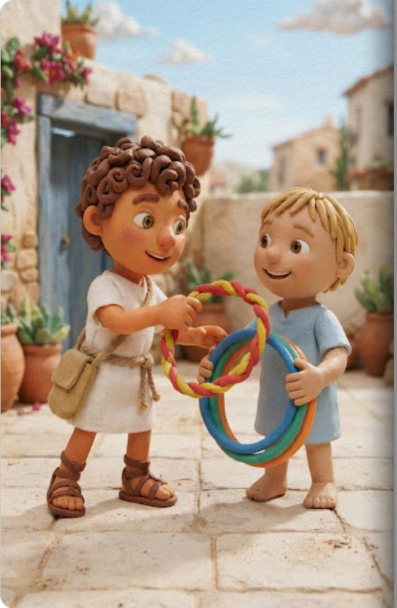
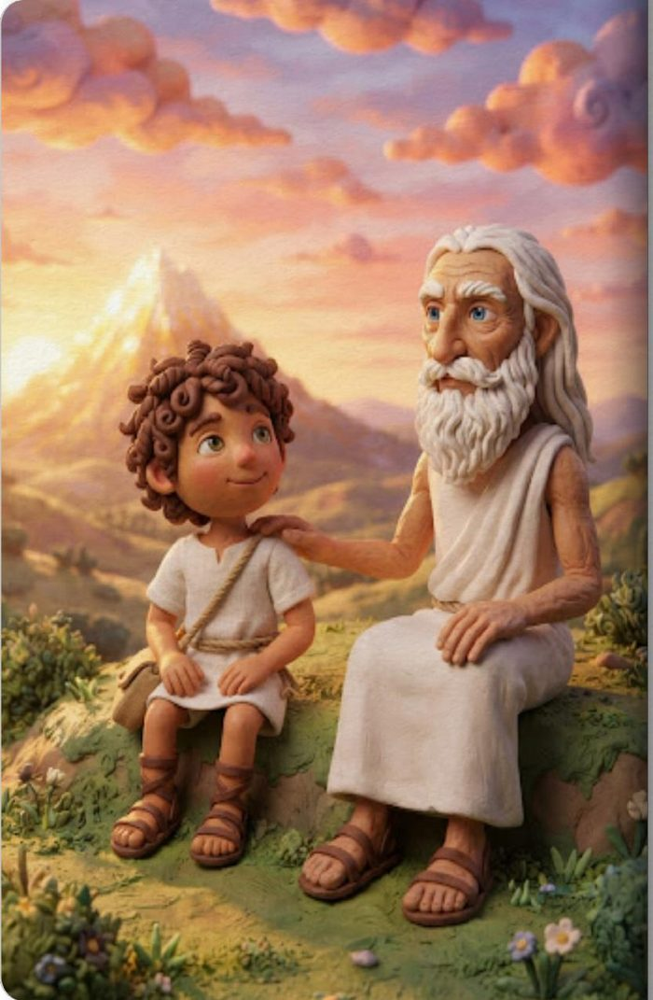

# 🏛️ L'IA entra in classe: che cosa fare?
### *Piccoli Filosofi nell'Agorà del Futuro*

**Progetto PATHS – Ministero dell'Istruzione e del Merito**
**Problemi filosofici: sfide dell'IA e sviluppi del pensiero critico**

| | |
|---|---|
| **Autrice** | Docente Sonia Cercelletta |
| **Destinatari** | Scuola Primaria – Classe Quarta |
| **Discipline coinvolte** | Filosofia per Bambini (P4C), Italiano, Educazione Civica, Tecnologia/Informatica, Arte e Immagine |
| **Durata complessiva** | 8 settimane (~20 ore di laboratorio) |

🔗 **[Apri il mockup interattivo completo →](index.html)**
*(su GitHub Pages, una volta pubblicato: `https://<tuo-utente>.github.io/<nome-repo>/`)*

---

## 📋 Indice

1. [Presentazione e motivazione pedagogica](#1-presentazione-e-motivazione-pedagogica)
2. [Quadro delle competenze](#2-quadro-delle-competenze)
3. [Obiettivi specifici di apprendimento](#3-obiettivi-specifici-di-apprendimento-osa)
4. [Integrazione dell'IA: strumenti e ruolo del docente](#4-integrazione-dellintelligenza-artificiale-strumenti-e-ruolo-del-docente)
5. [Articolazione operativa delle fasi didattiche](#5-articolazione-operativa-delle-fasi-didattiche)
6. [Tabella di sintesi delle fasi](#6-tabella-di-sintesi-delle-fasi-didattiche)
7. [Valutazione e autovalutazione](#7-valutazione-e-autovalutazione)
8. [Appendice: kit di prompt per l'insegnante](#8-appendice-operativa-kit-di-prompt-per-linsegnante)

---

## 1. Presentazione e motivazione pedagogica

L'ingresso dell'Intelligenza Artificiale nella scuola primaria non è un elemento di attrazione tecnologica né una scorciatoia cognitiva. All'interno del quadro teorico del progetto **PATHS**, l'IA viene qui declinata come **protesi maieutica** e **amplificatore narrativo**.

L'obiettivo fondante è usare le potenzialità dell'IA generativa (testo, immagini, sintesi vocale) per rendere concreti e visivamente coinvolgenti i grandi dilemmi del pensiero classico (Socrate e Aristotele), attraverso:

- 📖 Storybook interattivi a bivio (*Choose Your Own Adventure*)
- 🏛️ Simulatore di Avatar filosofici
- ⚖️ Gioco di simulazione etica **"La Bilancia delle Scelte"**

I bambini vengono guidati nell'**Agorà di classe** per sviluppare pensiero critico, capacità argomentativa, ascolto empatico e gestione consapevole delle scelte quotidiane.

---

## 2. Quadro delle competenze

### Competenze Chiave Europee (Raccomandazione del Consiglio, 2018)

| Competenza | Declinazione nell'UDA |
|---|---|
| **Alfabetica funzionale** | Esprimere opinioni motivate, argomentare nelle sessioni di Agorà, comprendere testi narrativo-filosofici |
| **Digitale** | Usare in modo critico i media digitali generati dall'IA; distinguere intelligenza umana e artificiale |
| **Personale, sociale, imparare a imparare** | Riflettere sulle emozioni, riconoscere il "Giusto Mezzo", coltivare l'amicizia autentica |
| **In materia di cittadinanza** | Partecipare a discussioni democratiche (P4C), formulare regole condivise, rispettare la pluralità delle idee |

### Traguardi per lo Sviluppo delle Competenze (Indicazioni Nazionali)

- **Italiano** — partecipa a scambi comunicativi rispettando i turni di parola; ascolta e comprende testi narrativi cogliendone senso globale e significati impliciti.
- **Educazione Civica** — sviluppa rispetto, collaborazione ed empatia; riflette sulle conseguenze delle proprie azioni e sulle scelte etiche.
- **Tecnologia** — esplora le potenzialità dei linguaggi digitali come supporto alla creatività e all'apprendimento.

---

## 3. Obiettivi Specifici di Apprendimento (OSA)

### Conoscenze
- Le figure chiave della filosofia classica: **Socrate** (la meraviglia, la domanda) e **Aristotele** (la felicità, il giusto mezzo, l'amicizia)
- Il **"Giusto Mezzo"** come equilibrio tra gli estremi del Troppo e del Poco
- I tre livelli dell'amicizia: **utile** (scambio), **dilettevole** (gioco), **autentica** (cuore)
- Funzionamento concettuale base di un modello di IA generativa (prompt, dati di input, scelte multiple)

### Abilità
- Argomentare la propria posizione in una discussione guidata (Agorà/P4C)
- Analizzare uno scenario etico quotidiano e individuare la scelta di equilibrio
- Collaborare alla creazione di cartelloni filosofici e allo storybook di classe
- Interagire attivamente con gli avatar filosofici, ponendo domande pertinenti e valutando le risposte

---

## 4. Integrazione dell'Intelligenza Artificiale: strumenti e ruolo del docente

L'insegnante impiega l'IA Generativa in fase di progettazione, erogazione e laboratorio, **mantenendo sempre la regia pedagogica**:

| Strumento IA | Funzione |
|---|---|
| **Storybook interattivi multimediali** (Choose Your Own Adventure) | Illustrazioni evocative dei racconti aristotelici (*La Montagna d'Oro*, *La Bilancia Magica*, *Il Fiore dei Tre Amici*), ramificazione delle scelte, sintesi vocale differenziata |
| **Agorà delle Domande & Avatar Filosofici** | Simulazione di ruolo (Socrate e Aristotele) con indovinelli e contro-domande maieutiche proiettate alla LIM |
| **Filo-Game "La Bilancia delle Scelte"** | Generazione dinamica di Carte Dilemma su situazioni reali (ricreazione, videogiochi, gestione della rabbia) |

---

## 5. Articolazione operativa delle fasi didattiche

### 🌱 Fase 1 — Socrate e l'Arte del Divenire Meravigliati *(Settimane 1-2, 4 ore — 2 sessioni da 2h)*
**Oggetto filosofico:** la meraviglia, l'ignoranza socratica ("so di non sapere"), il valore della domanda.

**Attività:** proiezione dell'Avatar di Socrate che sfida la classe; allestimento del cerchio dell'Agorà; creazione del **"Pozzo dei Perché"** (ogni bambino deposita una domanda aperta); l'IA trasforma le domande in indovinelli visivi e poetici proiettati alla LIM.

### ⛰️ Fase 2 — Aristotele e la Montagna della Felicità *(Settimane 3-4, 4 ore — 2 sessioni da 2h)*
**Oggetto filosofico:** la Felicità (*Eudaimonia*) e il percorso della Ragione.

**Attività:** fruizione dello storybook interattivo **"Il Segreto della Montagna d'Oro"** (Aris scala la montagna con lo zaino della Ragione); al bivio la classe sceglie tra scelte egoistiche o altruiste, osservando il peso dello zaino; realizzazione del cartellone **"Il Viaggio verso la Felicità"**.

### ⚖️ Fase 3 — Re Equilibrio e il Giusto Mezzo *(Settimane 5-6, 4 ore — 2 sessioni da 2h)*
**Oggetto filosofico:** la virtù aristotelica come "Giusto Mezzo" tra gli estremi del Troppo e del Poco.

**Attività:** fruizione dello storybook **"La Bilancia Magica di Re Equilibrio"** (Vigliacco, Spericolato, Coraggioso); Filo-Game **"La Bilancia delle Scelte"** a squadre con Carte dei Dilemmi Etici sui tre piatti; cartellone **"L'Equilibrio delle Scelte"** e dibattito maieutico.

### 🌸 Fase 4 — Il Fiore dei Tre Amici e l'Agorà Finale *(Settimane 7-8, 4 ore — 2 sessioni da 2h)*
**Oggetto filosofico:** l'amicizia secondo Aristotele (utilità, piacere, virtù/cuore).

**Attività:** fruizione dello storybook **"Il Fiore dei Tre Amici"** (petali: Gioco, Scambio, Cuore); cartellone **"Il Fiore degli Amici"** con dediche personali per il Petalo del Cuore; assemblaggio dell'**E-book digitale interattivo di classe**.

---

## 6. Tabella di sintesi delle fasi didattiche

| Fase | Titolo & Tematica | Storybook / Fonte Aristotelica | Attività Agorà / Gioco | Integrazione IA |
|---|---|---|---|---|
| **1** | Socrate e la Meraviglia | Introduzione al dialogo maieutico socratico | Il Pozzo dei Perché — cerchio P4C sulle domande aperte | Avatar parlante di Socrate ed indovinelli visivi |
| **2** | La Felicità e la Ragione | Il Segreto della Montagna d'Oro | Cartellone "Il Viaggio verso la Felicità" e zaino della Ragione | Storybook a scelte multiple con variazione visiva dello zaino |
| **3** | Il Giusto Mezzo | La Bilancia Magica di Re Equilibrio | Filo-Game "La Bilancia delle Scelte" e Cartellone "L'Equilibrio delle Scelte" | Generatore automatico di Carte Dilemma della vita scolastica |
| **4** | L'Amicizia Autentica | Il Fiore dei Tre Amici | Cartellone "Il Fiore degli Amici" e dediche al Petalo del Cuore | Assemblaggio dell'E-book digitale interattivo finale della classe |

---

## 7. Valutazione e autovalutazione

### Rubrica valutativa delle competenze (Docente)

| Competenza / Indicatori | Livello Avanzato | Livello Intermedio | Livello Base | In via di prima acquisizione |
|---|---|---|---|---|
| **Partecipazione all'Agorà (P4C)** | Interviene in modo pertinente, ascolta con empatia e sviluppa le idee altrui argomentando con chiarezza | Interviene in modo appropriato e rispetta i turni di parola | Interviene solo se sollecitato e rispetta le regole base | Fatica a rispettare i turni e mantenere l'attenzione |
| **Riflessione Etica (Giusto Mezzo)** | Individua autonomamente il Giusto Mezzo in situazioni complesse, motivando la scelta | Riconosce il Giusto Mezzo e distingue gli estremi | Riconosce la scelta corretta guidato da domande | Ha difficoltà a distinguere eccesso o difetto |
| **Competenza Digitale & Critica** | Interagisce in modo attivo e critico con l'IA, comprendendola come supporto al pensiero umano | Utilizza gli strumenti interattivi in modo corretto e partecipativo | Fruisce dei contenuti in modo passivo ma corretto | Necessita di guida costante |
| **Collaborazione (Cartelloni/Giochi)** | Coopera con entusiasmo, supporta i compagni e valorizza i contributi di tutti | Lavora in gruppo in modo costruttivo, porta a termine i compiti | Partecipa eseguendo le indicazioni date | Lavora in modo isolato o si distrae |

### Scheda di autovalutazione alunno — *"Il Diario del Piccolo Filosofo"*

> **Nome:** _______________________  **Data:** _____________
>
> 1. Oggi nell'Agorà ho ascoltato una risposta che mi ha fatto pensare a... _______________________
> 2. Questa settimana ho usato il "Giusto Mezzo" quando... _______________________
> 3. Con il mio compagno di banco ho coltivato il Petalo: ☐ del Gioco ☐ dello Scambio ☐ del Cuore — Perché: _______________________
> 4. Come mi sono sentito a parlare con l'Avatar del Filosofo? ☐ Meravigliato ☐ Curioso ☐ In dubbio

---

## 8. Appendice operativa: kit di prompt per l'insegnante

**Prompt 1 — Generazione Avatar Socrate (Maieutica)**
> Agisci come Socrate adattato per bambini di 9 anni della Scuola Primaria. Poni alla classe una sola domanda aperta e meravigliosa sul concetto di "Verità" o "Pensiero". Utilizza un tono caloroso, incoraggiante e maieutico. Non dare risposte definite, ma rispondi alle loro idee con altre domande che li spingano a ragionare.

**Prompt 2 — Generazione Carte Dilemma ("La Bilancia delle Scelte")**
> Sei un formatore didattico P4C per la scuola primaria. Genera 3 scenari di vita quotidiana per bambini di 9 anni dedicati al tema dell'intervallo scolastico. Per ogni scenario individua: 1) l'azione in Difetto (Poco), 2) l'azione in Eccesso (Troppo), 3) l'azione virtuosa di equilibrio (Giusto Mezzo). Usa un linguaggio semplice ed ingaggiante.

**Prompt 3 — Generazione Storybook a Bivio**
> Crea una variante narrativa a bivio per il racconto "Il Segreto della Montagna d'Oro". Il protagonista Aris incontra un compagno in difficoltà che ha perso la strada. Proponi due opzioni di scelta per la classe: Opzione A (proseguire da solo per arrivare prima in cima) e Opzione B (condividere le scorte dello zaino della Ragione ed aiutarlo). Descrivi brevemente le conseguenze educative per ciascuna scelta.

---

## 9. Storybook completo: Il Segreto della Montagna d'Oro

*Racconto integrale associato alla Fase 2 (Aristotele e la Montagna della Felicità). Testo e illustrazioni: Sonia Cercelletta.*

<p align="center">
  
</p>

<table>
<tr>
<td width="220"></td>
<td>

**Pagina 1**
Tra le colline dell'antica Grecia, viveva un bambino di nome Aris. Aveva i capelli ricci sempre scompigliati e una testa piena di pensieri. Quel mattino, un dubbio non lo lasciava in pace: "Ma cos'è che ci rende veramente felici?". Guardava i suoi amici correre, ma sentiva che la gioia di un gioco vinto svaniva troppo in fretta, proprio come una bolla di sapone.

</td>
</tr>
<tr>
<td width="220"></td>
<td>

**Pagina 2**
Aris pensò ai suoi giocattoli. "Forse la felicità è avere una trottola nuova!", si disse. Ma poi ricordò che le trottole si rompono. Pensò allora a un vaso pieno di miele dolcissimo. "Ma se ne mangio troppo, mi viene il mal di pancia!". Capì che le cose che si possono toccare o mangiare sono belle, ma la loro magia non dura per sempre.

</td>
</tr>
<tr>
<td width="220"></td>
<td>

**Pagina 3**
Proprio in quel momento, comparve il saggio Aristotele. Aveva una lunga barba bianca che sembrava panna montata e una veste candida. Aris lo chiamava spesso perché il Maestro sapeva spiegare il "perché" di ogni cosa, dalle stelle ai fiori. Con il cuore che batteva forte, Aris gli corse incontro: "Maestro! Mi dici il segreto della felicità vera?"

</td>
</tr>
<tr>
<td width="220"></td>
<td>

**Pagina 4**
Aristotele non rispose subito. Prese Aris per mano e lo portò vicino a una grande finestra che dava sulla piazza. "Vedi, Aris", disse indicando la gente che lavorava e i bambini che studiavano. "Molti pensano che la felicità sia un tesoro da trovare nel terreno. Ma la verità è che l'Eudaimonìa — la vera felicità — non è un oggetto, è un'azione. È qualcosa che si fa."

</td>
</tr>
<tr>
<td width="220"></td>
<td>

**Pagina 5**
"Immagina di voler scalare la Montagna d'Oro", spiegò il Maestro. "Per arrivare in cima, non basta correre a caso. Ci vuole lo zaino giusto. Non puoi riempirlo di dolci o giocattoli, perché ti peserebbero troppo durante la salita. Devi portarti solo ciò che serve davvero per il viaggio." Aris ascoltava incantato, cercando di visualizzare quella montagna splendente.

</td>
</tr>
<tr>
<td width="220"></td>
<td>

**Pagina 6**
Aristotele tirò fuori una bussola d'ottone. "Questa serve per non perdersi nei boschi. Ma noi ne abbiamo una speciale dentro di noi: la Ragione. Usare la testa per pensare e il cuore per fare del bene agli altri è come usare una bussola interiore. Si chiama Logos, ed è ciò che ci guida verso la vetta della montagna senza farci cadere nei burroni."

</td>
</tr>
<tr>
<td width="220"></td>
<td>

**Pagina 7**
Il Maestro raccolse un ramoscello d'ulivo. "Vedi questo ramo? Se lo pieghi troppo, si spezza. Se non lo curi, cresce storto. La felicità sta nel Giusto Mezzo. Non bisogna essere troppo temerari rischiando la vita, ma nemmeno dei codardi che scappano sempre. Quel punto di equilibrio perfetto, Aris, si chiama Virtù."

</td>
</tr>
<tr>
<td width="220"></td>
<td>

**Pagina 8**
Aris pensò al suo amico Nikos. A volte Nikos voleva sempre decidere a cosa giocare, diventando un po' prepotente. Aristotele spiegò che anche nell'amicizia serve equilibrio: essere gentili senza permettere agli altri di essere ingiusti. "Il Coraggio e la Temperanza sono i tuoi muscoli per la scalata," disse Aristotele, "e gli amici veri sono i tuoi compagni di cordata."

</td>
</tr>
<tr>
<td width="220"></td>
<td>

**Pagina 9 — Fine**
"E cosa c'è in cima, Maestro?" chiese Aris. "C'è l'Eudaimonìa," rispose Aristotele. "È una luce d'oro che brilla dentro di te e non si spegne mai, perché l'hai costruita tu, passo dopo passo, con le tue scelte giuste." Aris tornò a giocare con una nuova luce negli occhi: ora sapeva che la sua felicità dipendeva da come usava la sua bussola ogni giorno.

</td>
</tr>
</table>

> 🕹️ Nel [mockup interattivo](index.html) questo racconto è sfogliabile pagina per pagina (con narrazione vocale) nella sezione **Storybook**, e si conclude con il bivio a scelta "che zaino avrebbe dovuto scegliere Aris?".

---

## 10. Riferimenti bibliografici, sitografici e normativi

*Fonti verificate. Le voci corrette rispetto a una bozza precedente sono segnalate con °.*

### 10.1 Riferimenti istituzionali e Progetto PATHS (MIM / INDIRE)
- INDIRE & Ministero dell'Istruzione e del Merito (MIM). *PATHS – Per Parole / Philosophy for Schools*. Piattaforma e risorse didattiche per lo sviluppo del pensiero critico.
- INDIRE / MIM. *PATHS Summer School: "Problemi filosofici: sfide dell'IA e sviluppi del pensiero critico"*. Programma formativo per docenti.
- MIM. *Piano Nazionale Scuola Digitale (PNSD)* e Linee guida per l'orientamento e le STEM.

### 10.2 Philosophy for Children (P4C) e didattica della filosofia
- Cosentino, A. (a cura di) (2002). *Filosofia e formazione. 10 anni di Philosophy for Children in Italia (1991-2001)*. Napoli: Liguori.
- Cosentino, A. (2008). *Filosofia come pratica sociale. Comunità di ricerca, formazione e cura di sé*. Milano: Apogeo. °
- Lipman, M., Sharp, A. M., Oscanyan, F. S. (2004). *Il prisma dei perché*, trad. e adatt. A. Cosentino. Napoli: Liguori. °
- Lipman, M. (2005). *Educare al pensiero*, trad. A. Leghi. Milano: Vita e Pensiero.
- Santi, M. (a cura di) (2005). *Philosophy for Children: un curricolo per imparare a pensare*. Napoli: Liguori.
- Striano, M. (1999). *Educare al pensiero complesso. Il modello della Philosophy for Children*. Napoli: Liguori.

### 10.3 Fonti filosofiche classiche (Aristotele e Socrate)
- Aristotele. *Etica Nicomachea* (Giusto Mezzo, Felicità/Eudaimonia, forme di amicizia). Trad., intr. e note di C. Natali. Roma-Bari: Laterza, 1999.
- Platone. *Apologia di Socrate* e *Menone* (metodo dialogico e maieutico socratico). Trad. it. Roma-Bari: Laterza.

### 10.4 Intelligenza Artificiale e didattica innovativa
- Commissione Europea, Direzione Generale Istruzione, Gioventù, Sport e Cultura (2022, 25 ottobre). *Orientamenti etici sull'uso dell'intelligenza artificiale e dei dati nell'insegnamento e nell'apprendimento per gli educatori*. °
- Miao, F. & Holmes, W. (2023). *Guidance for Generative AI in Education and Research*. Parigi: UNESCO Publishing.
- Floridi, L. (2020). *Il verde e il blu: idee ingenue per migliorare la politica*. Milano: Raffaello Cortina Editore. °

### 10.5 Quadro normativo per la scuola primaria
- Ministero dell'Istruzione (2012). *Indicazioni Nazionali per il curricolo della scuola dell'infanzia e del primo ciclo d'istruzione*.
- Ministero dell'Istruzione (2018). *Indicazioni Nazionali e Nuovi Scenari*. Documento del Comitato Scientifico Nazionale.
- Raccomandazione del Consiglio dell'Unione Europea, del 22 maggio 2018, relativa alle competenze chiave per l'apprendimento permanente (2018/C 189/01).

> ° Voce corretta rispetto alla bozza originale dopo verifica delle fonti (editore, anno o titolo esatto).

---

## 📁 Contenuto del repository

```
.
├── README.md      → questo documento (UDA completa)
└── index.html     → mockup interattivo completo (Hub Piccoli Filosofi)
```

## 🚀 Come pubblicare il mockup con un link live (GitHub Pages)

1. Crea un nuovo repository su GitHub e carica entrambi i file (`README.md` e `index.html`).
2. Vai su **Settings → Pages**.
3. In **Branch**, seleziona `main` (o `master`) e cartella `/root`, poi salva.
4. Dopo circa un minuto, GitHub genera il link pubblico:
   `https://<tuo-nome-utente>.github.io/<nome-repo>/`
5. Quel link apre direttamente `index.html`, cioè il mockup interattivo completo, funzionante e navigabile online.

---

*Progetto PATHS – Ministero dell'Istruzione e del Merito · UDA a cura della Docente Sonia Cercelletta*
